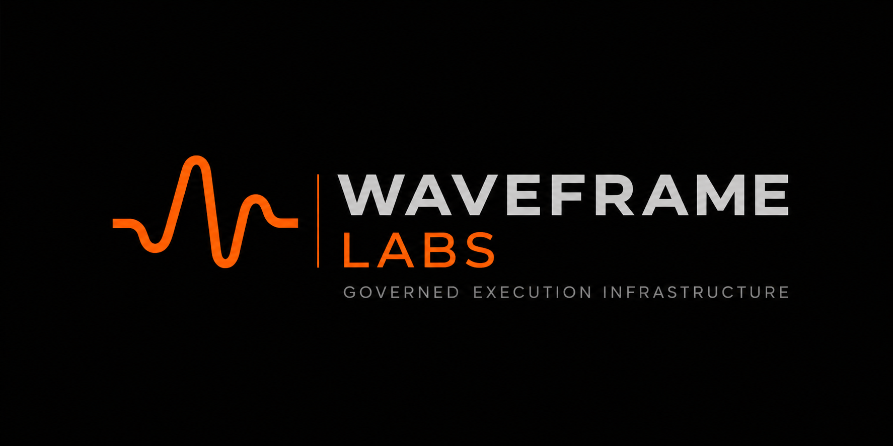

  

# WaveframeLabs.org

This repository hosts the canonical institutional website for **Waveframe Labs**, an independent research organization focused on governance, reproducibility, epistemic integrity, and deterministic infrastructure for AI-assisted work.

**Live site:** https://waveframelabs.org  
**Current website version:** `3.0.0`

## Domain boundary

| Surface | Responsibility |
| --- | --- |
| `waveframelabs.org` | Research institution, frameworks, publications, open technical record, and institutional updates |
| `waveframelabs.com` | Waveframe product, onboarding, documentation, pricing, Cloud, Console, and commercial operations |
| GitHub organization | Source repositories, releases, implementation evidence, and developer entry points |

The `.org` site may explain how research becomes operational infrastructure, but it is not the product landing page.

## Research portfolio

- **Aurora Research Initiative (ARI):** foundational institutional-governance research; maintenance mode
- **Aurora Workflow Orchestration (AWO):** foundational reproducibility methodology; maintenance mode
- **Neurotransparency:** stable published doctrine and specification; not currently implemented by the product runtime
- **Current technical research:** Ledger, Compiler, CRI-CORE, Guard, and the execution-governance boundary
- **Publications and case studies:** DOI-backed artifacts and applied demonstrations

Foundational lineage does not imply a current runtime dependency. Present behavior is defined by the active repositories' versioned contracts, source, tests, and releases.

## Site structure

- `index.html` — institutional homepage
- `research.html` — research program map
- `about.html` — organization and founder
- `publications.html` — canonical publication archive
- `updates.html` — chronological institutional and technical record
- `ari.html`, `awo.html`, `doctrine.html`, `nts.html`, `cri-core.html` — program pages
- `tools.html`, `hierarchy.html`, `compatibility.html`, `case-studies.html` — open technical reference
- `assets/institutional.css` — shared v3 institutional design system

## Publishing model

The site remains fully static, framework-free, buildless, and directly auditable from committed source. GitHub Pages publishes `main`; `CNAME` preserves `waveframelabs.org` and `.nojekyll` disables preprocessing.

## Authority boundary

This website describes and links to authoritative work. It does not itself define governance, publish authority, evaluate admissibility, enforce actions, or replace versioned research and software artifacts.

## License and contact

- Text and media: CC BY-NC-SA 4.0
- Code and scripts: Apache 2.0
- Contact: swright@waveframelabs.org
- ORCID: https://orcid.org/0009-0006-6043-9295

Copyright 2026 Waveframe Labs.
