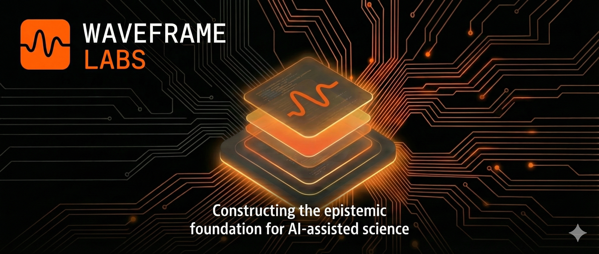

<p align="center">
  
</p>

# Waveframe Labs — Website Repository

This repository hosts the **canonical public website** for **Waveframe Labs**, an independent research institute operating under the **Aurora Research Initiative (ARI)**.

The website functions as the **public interface and reference surface** for the Aurora Ecosystem. It provides institutional documentation, architectural orientation, and authoritative links to governance, methodology, tooling, and case-study research.

**Live site:** https://waveframelabs.org  
**ARI Concept DOI:** https://doi.org/10.5281/zenodo.17743096

---

## Purpose and Scope

This repository exists to serve a single, well-defined role:

> **To present the canonical, human-readable public representation of the Aurora Ecosystem.**

It is **not** a research repository, a tooling repository, or a governance authority itself. Instead, it points *to* authoritative artifacts and documents that live elsewhere, while maintaining a stable, auditable institutional presence.

This site is designed to be:

- Fully static
- Framework-free
- Buildless and deterministic
- Directly auditable from source

Every rendered page corresponds directly to a committed file in this repository.

---

## Canonical Authority Boundaries

This website:

- **Does not define doctrine**
- **Does not define governance**
- **Does not enforce methodology**
- **Does not execute validation or tooling**

Instead, it **references** the following authoritative layers:

- **Neurotransparency Doctrine (NTD)** — epistemic rationale  
- **Neurotransparency Specification (NTS)** — enforceable disclosure requirements  
- **Aurora Research Initiative (ARI)** — governance authority  
- **Aurora Workflow Orchestration (AWO)** — methodology  
- **CRI-CORE** — enforcement (referenced, not implemented here)  
- **Case Studies** — applied research conducted under the stack  

In the event of any conflict, authority flows outward to the referenced documents, not inward to this site.

---

## Site Structure

The site consists of hand-authored static HTML files.

### Primary Pages

- `index.html` — institutional overview and Aurora stack entry point  
- `hierarchy.html` — Aurora layer architecture and authority boundaries  
- `doctrine.html` — Neurotransparency Doctrine (Layer 0)  
- `nts.html` — Neurotransparency Specification  
- `ari.html` — Aurora Research Initiative governance  
- `awo.html` — Aurora Workflow Orchestration methodology  
- `cri-core.html` — enforcement layer overview  
- `tools.html` — deterministic tooling and infrastructure  
- `case-studies.html` — applied research and demonstrations  
- `updates.html` — canonical institutional release log  

### Supporting Files

- `waveframe-logo-mark.png`
- `waveframe-logo-full.png`
- `CNAME` — custom domain configuration
- `.nojekyll` — disables Jekyll processing

---

## Updates and Change History

All authoritative announcements, releases, and institutional milestones are recorded in:

**`updates.html` — Canonical Institutional Log**

This log is:

- Chronological
- Factual
- Append-only
- Publicly auditable

Git commit history supports implementation tracking, but **updates.html** is the authoritative public record of ecosystem-level changes.

---

## Versioning Philosophy

This repository uses **semantic versioning to indicate institutional stability**, not feature velocity.

A version tag signals:

- Structural coherence of the site
- Stable interpretation of pages and references
- Alignment with current Aurora governance state

Minor visual or copy changes do not necessarily imply a version change.

---

## Editing and Deployment

Deployment is handled automatically via **GitHub Pages**.

1. Edit a static file (e.g., `index.html`)
2. Commit to the `main` branch
3. GitHub Pages redeploys automatically

There is no build step, CI pipeline, or preprocessing layer. This is intentional and aligned with Aurora transparency principles.

---

## Custom Domain Configuration

Waveframe Labs uses a custom domain managed via Porkbun.

### Apex A Records

```
185.199.108.153
185.199.109.153
185.199.110.153
185.199.111.153
```

### CNAME (www)

```
waveframelabs.github.io
```

### Repository CNAME File

```
waveframelabs.org
```

The `.nojekyll` file ensures files are served exactly as committed.

---

## License

- **Text and media:** CC BY-NC-SA 4.0  
- **Code and scripts:** Apache 2.0  

© 2026 Waveframe Labs.

---

## Governance and Contact

Waveframe Labs operates under the **Aurora Research Initiative (ARI)**.

**Contact:** swright@waveframelabs.org  
**ORCID:** https://orcid.org/0009-0006-6043-9295
